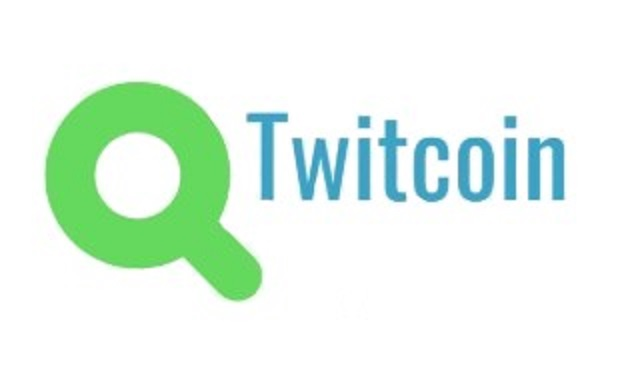

[![Contributors][contributors-shield]][contributors-url]
[![Forks][forks-shield]][forks-url]
[![Stargazers][stars-shield]][stars-url]
[![Issues][issues-shield]][issues-url]
[![MIT License][license-shield]][license-url]


<br />
<p align="center">
  <a href="https://github.com/jespetius/twitcoin">
    
  </a>

  <h3 align="center">Twitcoin</h3>

  <p align="center">
    Twitcoin - a school coding project aimed at helping you navigate the vast sea of information that Twitter is.
    <br />
    <a href="https://github.com/jespetius/twitcoin"><strong>GitHub »</strong></a>
    <br />
    <br />
    <a href="https://github.com/jespetius/twitcoin">Watch demo</a>
    ·
    <a href="https://github.com/jespetius/twitcoin/issues/new">Report a bug</a>
    ·
    <a href="https://github.com/jespetius/twitcoin/issues/new">Request a feature</a>
  </p>
</p>


## Contents

* [About the Project](#about-the-project)
  * [Built With](#built-With)
* [Getting Started](#getting-started)
  * [Prerequisites](#prerequisites)
  * [Installation](#Installation)
* [Usage](#usage)
* [The Futher Development](#the-futher-development)
* [Contributing](#contributing)
* [License](#license)
* [Contact Us](#contact-us)

## Keywords

Twitter, Python


## About the Project

[![Product Name Screen Shot][product-screenshot]](https://example.com)

Twitcoin is a project aimed at retrieving data from tweets with the help of [Twitter's free API](https://developer.twitter.com/en/apply-for-access) and natural language processing. Our main goal is to grant users an easier way to access the vast sea of information on Twitter through our app. At this stage of the project, the application can search a users tweets and return their sentiment analysis.


<!-- Viitekehykset, jota olemme käyttäneet projektissamme -->
### Built With

* [React Native](https://reactnative.dev/)
* [Flask](https://flask.palletsprojects.com/en/1.1.x/)
<!-- 
* []()
* []()
-->

<!-- Aloitusprosessi, miten ohjelmaa voi itse käyttää -->
## Getting Started

Our application is free for everyone to access.
If you want to use your application, you can do so easily by following the next steps.


<!-- Mitä kaikkea ohjelman käyttäminen vaatii -->
### Prerequisites

Install the following packages and/or files
* npm
```sh
npm install npm@latest -g
```
* pip
```sh
pip install -r requirements.txt
python
import nltk
nltk.download()
nltk.download('vader_lexicon')
nltk.download('punkt')
```

<!-- Asennusohjeet -->
### Installation
 

1. Apply for a free [API-key](https://developer.twitter.com/en/apply-for-access)
2. Clone the repository
```sh
git clone https://github.com/jespetius/twitcoin.git
```
3. Install the NPM packages & expo
```sh
npm install
npm install expo
```
4. Create an auth.py file inside the flask_app
```sh
consumer_key = 'YOUR KEY HERE'
consumer_secret = 'YOUR KEY HERE' 
access_token = 'YOUR KEY HERE' 
access_token_secret = 'YOUR KEY HERE'

```
<!-- Käyttöohjeet -->
## Usage

1. Start your flask backend by following these steps
```sh
set FLASK_APP=YOUR OWN COMPUTER PATH\flask_app\app.py
cd flask_app
flask run
```
If your cmd looks like this, you are ready to rock.
```sh
 * Serving Flask app "app.py"
 * Environment: production
   WARNING: This is a development server. Do not use it in a production deployment.
   Use a production WSGI server instead.
 * Debug mode: off
 * Running on http://127.0.0.1:5000/ (Press CTRL+C to quit)
```
2. Start expo
```sh
expo start
```
## The Further Development
We have multiple development ideas. 
[Development ideas](https://github.com/jespetius/twitcoin/issues)

## Contributing

If you are interested in contributing to the project, you can easily do so by following the next steps.

1. Fork the Project
2. Create your Own Branch (`git checkout -b branchname`)
3. Commit your Changes (`git commit -m 'description'`)
4. Push to the Branch (`git push origin branchname`)
5. Open a Pull Request


## License

Distributed under the MIT License. See [LICENSE](https://github.com/jespetius/twitcoin/blob/master/LICENSE) for more information.

## Contact Us

Ossi Mikkonen - ossi.mikkonen@myy.haaga-helia.fi

Jesperi Kuula - jesperi.kuula@myy.haaga-helia.fi

Mikko Miettinen - mikko.miettinen@myy.haaga-helia.fi

Joonas Lagzouli - joonas.lagzouli@myy.haaga-helia.fi


Project Link: [Twitcoin](https://github.com/jespetius/twitcoin)


[contributors-shield]: https://img.shields.io/github/contributors/jespetius/twitcoin.svg?style=flat-square
[contributors-url]: https://github.com/jespetius/twitcoin/graphs/contributors
[forks-shield]: https://img.shields.io/github/forks/jespetius/twitcoin.svg?style=flat-square
[forks-url]: https://github.com/jespetius/twitcoin/network/members
[stars-shield]: https://img.shields.io/github/stars/jespetius/twitcoin.svg?style=flat-square
[stars-url]: https://github.com/jespetius/twitcoin/stargazers
[issues-shield]: https://img.shields.io/github/issues/jespetius/twitcoin.svg?style=flat-square
[issues-url]: https://github.com/jespetius/twitcoin/issues
[license-shield]: https://img.shields.io/github/license/jespetius/twitcoin.svg?style=flat-square
[license-url]: https://github.com/jespetius/twitcoin/blob/master/LICENSE
[product-screenshot]: images/etusivu.jpg
